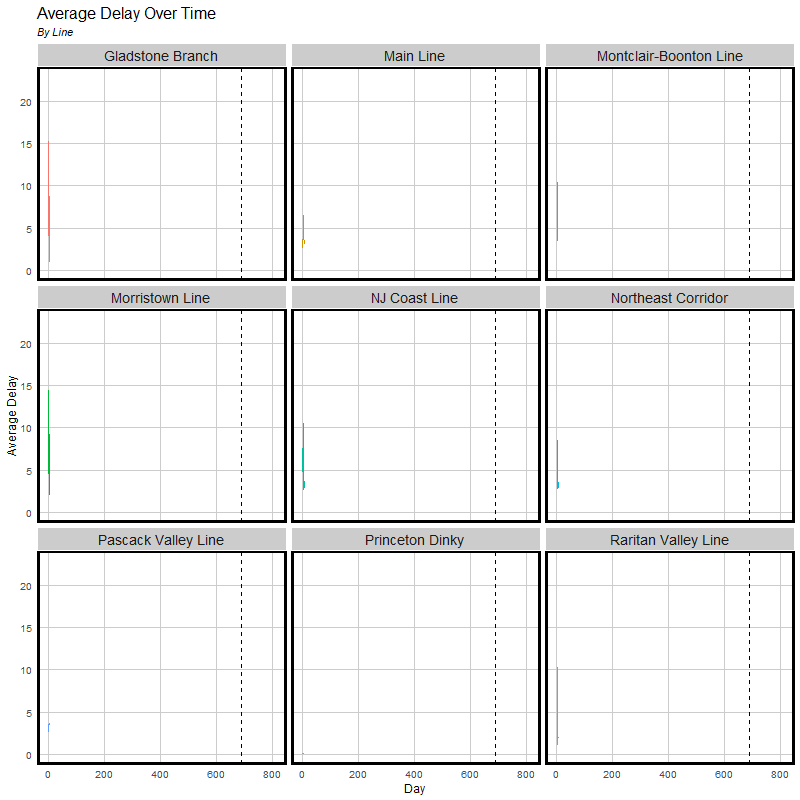
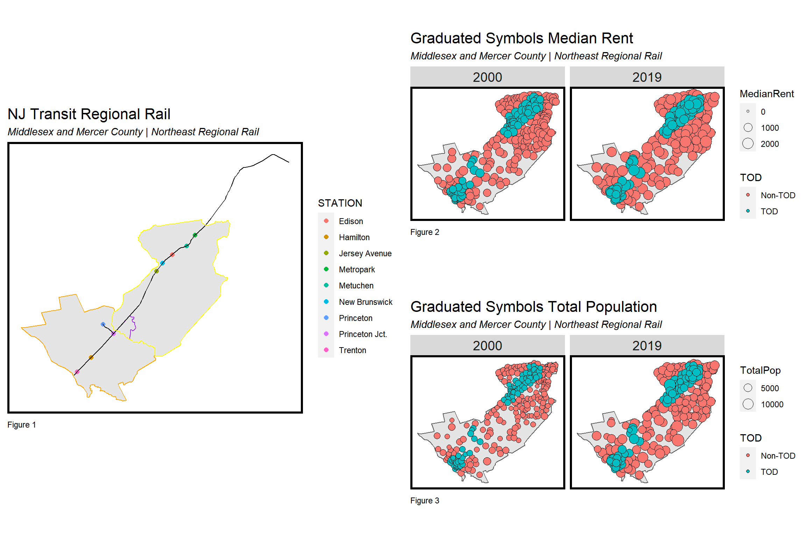
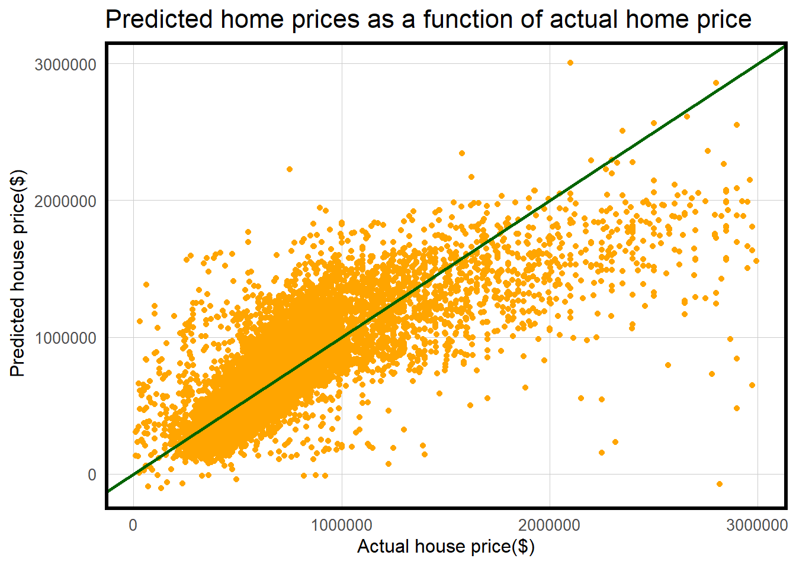
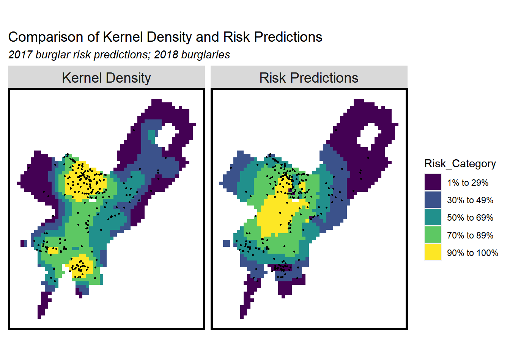
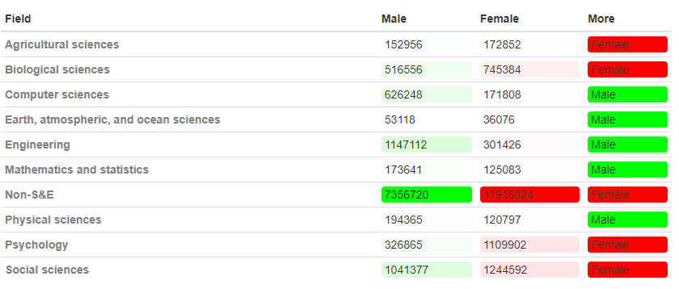
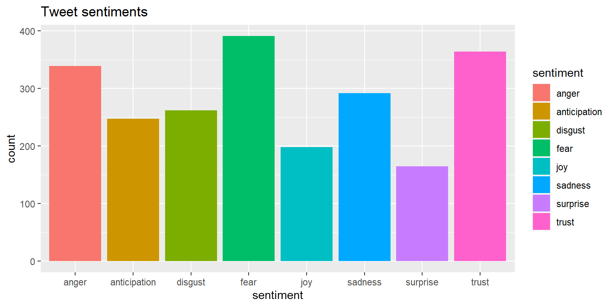

# Portfolio

## Course Work

---

### MUSA 508 - Public Policy Analysis Assignments
<i>Instructor: Dr. Michael Fichman and Matt Harris</i>
 
Course Description: This course teaches advanced spatial analysis and an introduction to data science/machine learning in the urban planning and public policy realm. The class focuses on real-world spatial analysis applications and, in combination with introductory machine learning, provides students a modern framework for efficiently allocate limited resources across space. We will learn novel approaches for ensuring our models do not discriminate against communities/people of color as well as communities of different income levels. 

---

<b>[NJ Transit - Predicting Late Trains](/Projects/MUSA508_Final.html)</b>
 
<i>Author: Jonathon Sun and Johnathan Clementi</i>
 
THIS PROJECT IS STILL IN PROGRESS 12-15-2021

Although train delays may seem like minor annoyances in the daily life of a commuter, there are real economic costs to train tardiness. The city of New York Office of the Controller found that major delays (5 minute delays) annually cost the city $170.2 million dollars (Stringer, 2017). Although this study was done on subway delays, the same idea can be applied to regional trains as the NJTransit has a history of delays (McGeehan, 2018). The algorithm that we have developed predicts how late trains will be based on a variety of variables, and can be utilized by agencies, researchers, and the average commuter. 

We used data from <a href="https://www.kaggle.com/pranavbadami/nj-transit-amtrak-nec-performance?select=2018_11.csv">Kaggle</a> to predict lateness of trains and a linear regression which takes into account, weather, time, adnd other variables to predict lateness of trains. 

[Presentation link](https://www.youtube.com/)

---

<b>[Transit Oriented Development - Mercer and Middlesex County New Jersey](/Projects/MUSA508_HW1.html)</b>
 
<i>Author: Jonathon Sun</i>
 
This project used data from `tidycensus` and NJtransit to determine if proximity towards regional rail had higher educational attainment. 

---

<b>[Home Price Predictions](/Projects/MUSA508_HW2.html)</b>
 
<i>Authors: Jonathon Sun and Johnathan Clementi</i>
 
This project used linear regression to estimate the sale price of homes in Boulder, Colorado. 

---
<b>[Risk Prediction - Within Family Crime](/Projects/MUSA508_HW3.html)</b> 
 
<i>Author: Jonathon Sun</i>
 
This project attempted to predict within family crime using gambling violations, public drunkness, and rape occurrences as nearest neighbors. This project focused on using fishnets. 

---
<b>[Risk Prediction - Within Family Crime](/Projects/MUSA508_HW3.html)</b> 
 
<i>Author: Jonathon Sun</i>
 
This project attempted to predict within family crime using gambling violations, public drunkness, and rape occurrences as nearest neighbors. This project focused on using fishnets. 

---

### STATS 701 - Modern Data Mining 
<i>Instructor: Dr. Linda Zhao</i> 
  
Statistics has been evolving rapidly in the era of big data and provides tools to harvest knowledge
from big data. Focusing on methodologies with reasoning, the class brings in a large set of cutting
edge machine learning techniques with applications. Hands-on data experience with R throughout
the semester is another feature. The class will begin with data acquisition and exploratory data
analysis (EDA) along with tools for reproducible report, an essential part of data science. We next
show how to build, interpret, and adopt basic models; then go beyond to contemporary methods
and techniques for handling large and complex data with applications in finance, marketing,
medical fields, social science, entertainment, you name it. While this course extensively uses the
statistical programming language R, no programming experience is required. By the end of the
semester, students will master popular modern statistical methods but also get equipped with
hands-on skills in handling data of essentially any size.

---

<b>[Wharton Radio, Women in Science, and Major Leage Baseball Case Studies](/Projects/STAT701_HW1.html)</b>
 
<i>Authors: Jonathon Sun, Joyce Zhang, and Ying Dai</i> 
 
This assignment consisted of three difference case studies. The first was understanding who was listening to Wharton Radio. The second case was women in science and what women are studying. The last case was analyzing Major League Baseball Payroll and win rates.

---

<b>[Sentiment Towards Asian Americans Twiter data](/Projects/STAT701_Final.html)</b>
 
<i>Authors: Jonathon Sun, Joyce Zhang, and Ying Dai</i> 
 
The final in this course was a topic of our choosing. Asian American hate crimes has been on the rise since the beginning of covid-19 with rhetoric such as Kung-flu and the China virus. Due to the current social climate, twitter data using the search term Asian American is more crucial than ever to understand how Asian Americans are framed within the broader racial context of the United States. As such, the purposes of our final project are to 1) explore how Asian Americans are framed and described in social media during the COVID-19 pandemic; and 2) predict what common words are most likely to increase the likelihood of a tweet being retweeted on the topics around Asian Americans. Using data from Asian-American related tweets over the past five-months Twitter data between November 30th, 2020 2020 to April 1st, 2021 were collected using a tool called “ If This, Then That (IFTTT)” (https://ifttt.com/). We propose to use text mining, lasso, logistic regression, random forest, and neuro networks to conduct our analysis. Specifically using LASSO and logistic regression to build a “best” model to predict a tweet gets retweeted and builds a separate model using random forest and neuro networks respectively to compare which approach works best.
S

---

## Personal Projects
These are projects that I took up on my own for fun.

---

[Regional Foot Traffic Analysis](/Projects/SafeGraph_FootTraffic.html)

---

Page template forked from <a href="https://github.com/evanca/quick-portfolio">evanca</a>

<!-- Remove above link if you don't want to attibute -->
